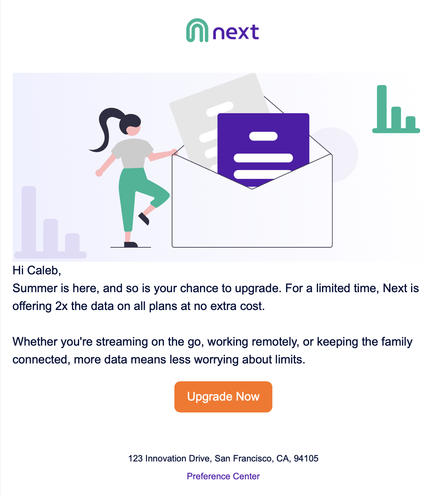

# Day 3 - Email Content Creation

Build the summer campaign email with brand guidelines, Content Builder elements, and basic personalization.

## Contents
| File | Purpose |
|------|---------|
| `brand-spec.md` | Brand values (colors, fonts, logo) for setting up the brand in the CMS workspace. |
| `email-copy.md` | The campaign email copy to build in Content Builder. |
| `email-hero.png` | Hero image for the campaign email. |
| `next-logo.png` | The Next logo. |
| `email-final.png` | Preview of the finished email. |
| `email-sample.html` | Sample rendered email for reference. |

## Previews
| Email hero | Finished email | Logo |
|:---:|:---:|:---:|
|  |  |  |

## How to use
1. Set the brand from `brand-spec.md` and add `next-logo.png`.
2. Build the email with the copy in `email-copy.md` and `email-hero.png`.
3. Compare your result against `email-final.png` and `email-sample.html`.

---
New here? Start the 30-day Marketing Cloud challenges for free at marketingcloud30.com
