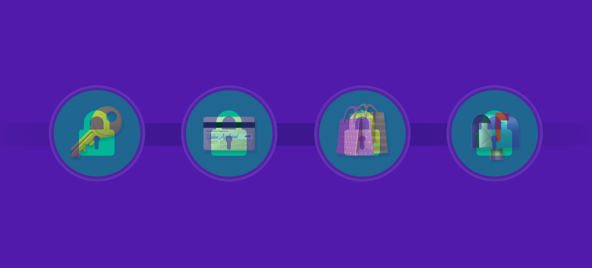
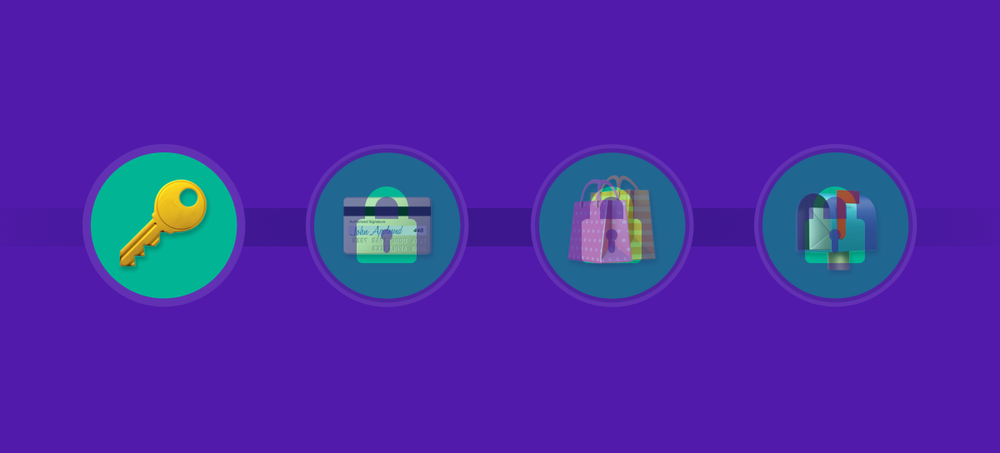
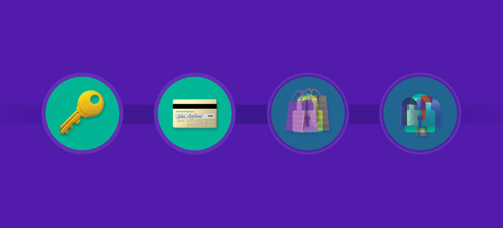
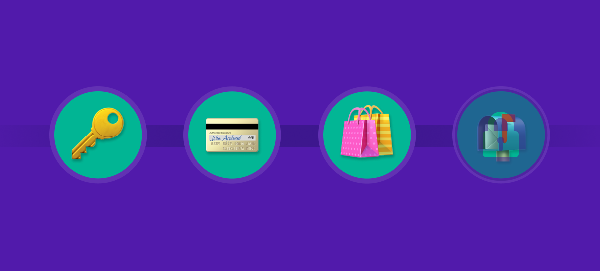
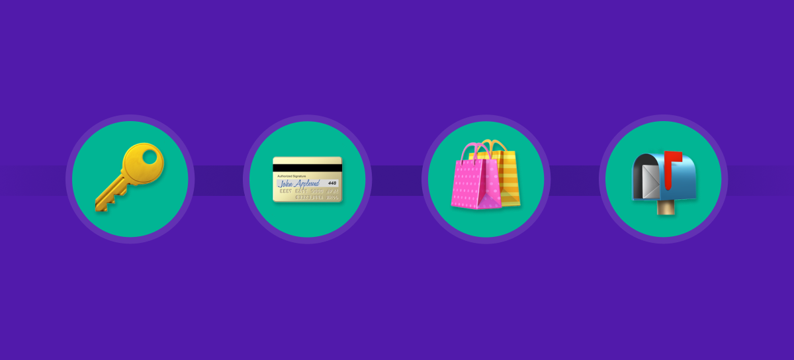

# Day 23 - Personalize an Email with Handlebars

Read each customer's account-setup progress from a Marketing Object and swap the email's hero banner and body copy to match their next unfinished step.

## Contents
| File | Purpose |
|------|---------|
| `set-password.png, add-card.png, connect-rewards.png, update-prefs.png, all-set.png` | The five hero banners, one per setup step. |

## Previews
| Set password | Add payment | Connect rewards | Update prefs | All set |
|:---:|:---:|:---:|:---:|:---:|
|  |  |  |  |  |

## How to use
1. Upload the five banners to your org; note each image URL.
2. Clone the previous email, rename it "Account Setup Nudge".
3. Add an HTML component (banner) and a Paragraph component (body) following the challenge solution, swapping in your banner URLs.
4. Preview with a recipient from the AccountSetupProgress__mo Marketing Object.

Requires the AccountSetupProgress__mo Marketing Object from the previous challenge.

---
New here? Start the 30-day Marketing Cloud challenges for free at marketingcloud30.com
